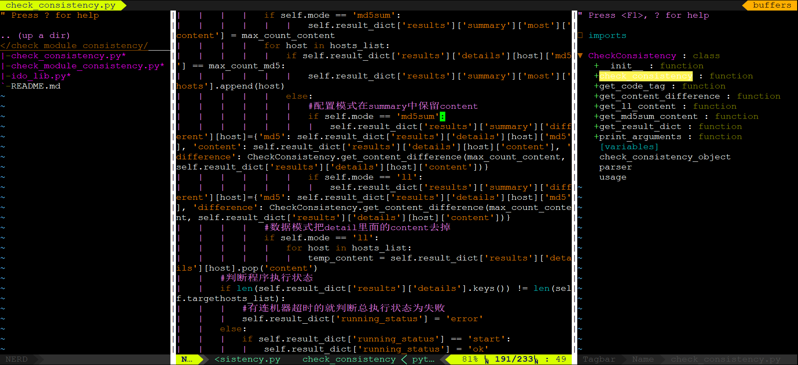

# config-vim

<!-- TOC -->

- [config-vim](#config-vim)
    - [安装步骤：](#安装步骤)
        - [1. 安装Vundle](#1-安装vundle)
        - [2. 修改~/.vimrc](#2-修改vimrc)
        - [3. 开始安装插件](#3-开始安装插件)
    - [示例图](#示例图)
    - [配置说明](#配置说明)

<!-- /TOC -->

~/.vimrc文件是vim的配置文件。
## 安装步骤：
### 1. 安装Vundle

[Vundle在GitHub上的URL](https://github.com/VundleVim/Vundle.vim)

`git clone https://github.com/VundleVim/Vundle.vim.git ~/.vim/bundle/Vundle.vim`

### 2. 修改~/.vimrc

```vim
set encoding=utf-8 fileencodings=ucs-bom,utf-8,gbk,cp936

set nocompatible              " be iMproved, required
filetype off                  " required

" set the runtime path to include Vundle and initialize
set rtp+=~/.vim/bundle/Vundle.vim
call vundle#begin()
" alternatively, pass a path where Vundle should install plugins
"call vundle#begin('~/some/path/here')

" let Vundle manage Vundle, required
Plugin 'VundleVim/Vundle.vim'
Plugin 'The-NERD-tree'
Plugin 'majutsushi/tagbar'
Plugin 'vim-airline/vim-airline'
Plugin 'vim-airline/vim-airline-themes'
Plugin 'scrooloose/syntastic'
Plugin 'tComment'
Plugin 'hynek/vim-python-pep8-indent'
Plugin 'Yggdroot/indentLine'
Plugin 'fatih/vim-go'
Plugin 'tpope/vim-surround'
Plugin 'jiangmiao/auto-pairs'
Plugin 'terryma/vim-multiple-cursors'
Plugin 'shawncplus/phpcomplete.vim'

" All of your Plugins must be added before the following line
call vundle#end()            " required
filetype plugin indent on    " required
" To ignore plugin indent changes, instead use:
"filetype plugin on
"
" Brief help
" :PluginList       - lists configured plugins
" :PluginInstall    - installs plugins; append `!` to update or just:PluginUpdate
" :PluginSearch foo - searches for foo; append `!` to refresh local cache
" :PluginClean      - confirms removal of unused plugins; append `!` to auto-approve removal
"
" see :h vundle for more details or wiki for FAQ
" Put your non-Plugin stuff after this line

nmap <F2> :NERDTreeToggle<CR>
let g:NERDTreeDirArrows = 0

nmap <F3> :TagbarToggle<CR>

set t_Co=256
set laststatus=2
let g:airline#extensions#whitespace#enabled = 0
let g:airline#extensions#whitespace#symbol = '!'
let g:airline_powerline_fonts = 1
if !exists('g:airline_symbols')
	let g:airline_symbols = {}
endif
" old vim-powerline symbols
let g:airline_left_sep = '⮀'
let g:airline_left_alt_sep = '⮁'
let g:airline_right_sep = '⮂'
let g:airline_right_alt_sep = '⮃'
let g:airline_symbols.branch = '⭠'
let g:airline_symbols.readonly = '⭤'
let g:airline_symbols.linenr = '⭡'
let g:airline_symbols.maxlinenr = '⭡'
let g:airline#extensions#tabline#enabled = 1
nnoremap <F5> :bn<CR>
nnoremap <F6> :bp<CR>
nnoremap <F7> :bd<CR>

set statusline+=%#warningmsg#
set statusline+=%{SyntasticStatuslineFlag()}
set statusline+=%*

let g:syntastic_always_populate_loc_list = 1
let g:syntastic_auto_loc_list = 1
let g:syntastic_check_on_open = 1
let g:syntastic_check_on_wq = 0

set backspace=indent,eol,start
set list lcs=tab:\|\ 
syntax on
set smartindent
set showcmd
set tags=tags;
set autochdir
autocmd FileType python,php,html,css,javascript setlocal et sta sw=4 sts=4
autocmd CursorMovedI * if pumvisible() == 0|pclose|endif
autocmd InsertLeave * if pumvisible() == 0|pclose|endif
```
### 3. 开始安装插件

进入VIM然后:PluginInstall

airline需要安装字体：[airline字体](https://github.com/powerline/fonts)，git clone下来sh安装脚本就行。

airline配置看这个：[airline配置](http://note.youdao.com/noteshare?id=23a98148642a7b994ae53e22b515019c&sub=465EE16A802E45F9B0B6D6CA79CE37EC)。

注意，Yggdroot/indentLine这个插件需要vim7.3以上版本。我是先把自带vim卸了然后编译安装的vim8.0。

## 示例图


## 配置说明

```vim
" 自动转换编码为UTF-8
set encoding=utf-8 fileencodings=ucs-bom,utf-8,gbk,cp936

" vundle配置
set nocompatible              " be iMproved, required
filetype off                  " required

" set the runtime path to include Vundle and initialize
set rtp+=~/.vim/bundle/Vundle.vim
call vundle#begin()
" alternatively, pass a path where Vundle should install plugins
"call vundle#begin('~/some/path/here')

" let Vundle manage Vundle, required
" vim插件管理系统vundle
Plugin 'VundleVim/Vundle.vim'
" 左侧文件浏览器
Plugin 'The-NERD-tree'
" 右侧变量、类浏览器
Plugin 'majutsushi/tagbar'
" 下方和上方的导航条
Plugin 'vim-airline/vim-airline'
Plugin 'vim-airline/vim-airline-themes'
" 语法检测
Plugin 'scrooloose/syntastic'
" 快速注释
Plugin 'tComment'
" python缩进
Plugin 'hynek/vim-python-pep8-indent'
" 显示缩进竖线
Plugin 'Yggdroot/indentLine'
" go语言工具包
Plugin 'fatih/vim-go'
" 快速修改环绕符号，如'"()[]{}<>
Plugin 'tpope/vim-surround'
" 自动生成配对符号，如'"()[]{}<>
Plugin 'jiangmiao/auto-pairs'
" 多光标同时编辑
Plugin 'terryma/vim-multiple-cursors'
" PHP补全插件
Plugin 'shawncplus/phpcomplete.vim'

" vundle配置
" All of your Plugins must be added before the following line
call vundle#end()            " required
filetype plugin indent on    " required
" To ignore plugin indent changes, instead use:
"filetype plugin on
"
" Brief help
" :PluginList       - lists configured plugins
" :PluginInstall    - installs plugins; append `!` to update or just:PluginUpdate
" :PluginSearch foo - searches for foo; append `!` to refresh local cache
" :PluginClean      - confirms removal of unused plugins; append `!` to auto-approve removal
"
" see :h vundle for more details or wiki for FAQ
" Put your non-Plugin stuff after this line

" 设置F2为文件浏览器插件NERDTree的快捷键
nmap <F2> :NERDTreeToggle<CR>
let g:NERDTreeDirArrows = 0

" 设置F3为插件tagbar的快捷键
nmap <F3> :TagbarToggle<CR>

" 插件airline的配置
set t_Co=256
set laststatus=2
let g:airline#extensions#whitespace#enabled = 0
let g:airline#extensions#whitespace#symbol = '!'
let g:airline_powerline_fonts = 1
if !exists('g:airline_symbols')
	let g:airline_symbols = {}
endif
" old vim-powerline symbols
let g:airline_left_sep = '⮀'
let g:airline_left_alt_sep = '⮁'
let g:airline_right_sep = '⮂'
let g:airline_right_alt_sep = '⮃'
let g:airline_symbols.branch = '⭠'
let g:airline_symbols.readonly = '⭤'
let g:airline_symbols.linenr = '⭡'
let g:airline_symbols.maxlinenr = '⭡'
let g:airline#extensions#tabline#enabled = 1

" 设置F5和F6为buffer切换的快捷键，F7为删除buffer的快捷键
nnoremap <F5> :bn<CR>
nnoremap <F6> :bp<CR>
nnoremap <F7> :bd<CR>

" 语法检测插件syntastic的显示设置
set statusline+=%#warningmsg#
set statusline+=%{SyntasticStatuslineFlag()}
set statusline+=%*

let g:syntastic_always_populate_loc_list = 1
let g:syntastic_auto_loc_list = 1
let g:syntastic_check_on_open = 1
let g:syntastic_check_on_wq = 0

" 智能退格删除，一次删4个空格
set backspace=indent,eol,start
" 显示缩进竖线
set list lcs=tab:\|\ 
" 语法高亮
syntax on
" 智能缩进
set smartindent
" 显示执行的命令
set showcmd
" ctags设置，智能寻找tags文件
set tags=tags;
set autochdir
" 这些类型的文件tab缩进键转换为4个空格
autocmd FileType python,php,html,css,javascript setlocal et sta sw=4 sts=4
" 自动离开补全时的函数提示窗口
autocmd CursorMovedI * if pumvisible() == 0|pclose|endif
autocmd InsertLeave * if pumvisible() == 0|pclose|endif
```